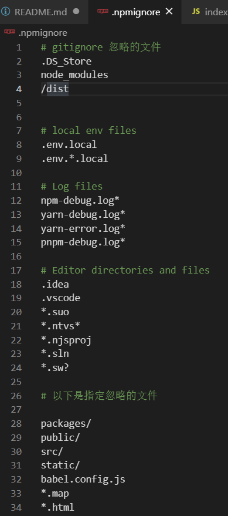

## 搭建自己的UI组件库并发布到 npm 
致前端初学者，在我们平时开发过程中，有从 npm 上依赖许多的组件，常见的如一些ui组件库，elementui、antddesign之类的，那这些组件如何封装引用，并打包到 npm 上供我们使用的呢？在这我们将简单的写一个例子，学会如何去做一个组件，并将它导出引用，最后将它发布到 npm 上。

### 教程
- #### 用 vue-cli 创建项目
    因为我们将封装的是适用于 vue-cli 框架的组件库，所以组件库的项目也是用 vue-cli 去搭建。
    ```js
    vue create hx-ui
    ```
- #### 新建组件
    1、在 src 同级目录下创建 packages 文件夹，用来存放封装的组件。在 packages 下面新建一个 hxButton 组件文件夹，同时新建一个index.js 文件，用来导出所有组件。并在 hxButton 文件夹中新建 index.js 文件 和 src 文件夹，在 src 中创建 hxButton.vue 文件目录结构如下：
    

    2、在 hxButton.vue 中编写组件
    ```vue
    <template>
        <button class="testBtn">测试按钮</button>
    </template>
    <script>
        export default {
            name: 'hxButton' // 注意这个name是必须的
        }
    </script>
    <style lang="scss" scoped>
    .testBtn {
        width: 100px;
        height: 50px;
        margin: 0 10px;
        background-color: #fc297f;
        font-size: 16px;
        border-radius: 5px;
        border: none;
        cursor: pointer;
    }
    </style>
    ```
    3、在hxButton文件夹下的 index.js 文件暴露组件
    ```js
    // 暴露组件
    import hxButton from './src/hxButton'
    hxButton.install = vue => {
        vue.component(hxButton.name, hxButton)
    }
    export default hxButton
    ```
    4、最后在 packages 文件夹下的 index.js 中导出packages所有组件
    ```js
    // 引入组件
    import hxButton from './hxButton';

    // 所有组件列表
    const components = [hxButton];

    // 定义 install 方法，接受 Vue 作为参数
    const install = function (Vue) {
        // 判断是否安装，安装过就不继续往下执行
        if (install.installed) return;
        install.installed = true;
        // 遍历注册所有组件
        components.map(component => Vue.use(component));
    }

    // 检测到 Vue 才执行，毕竟我们是基于 Vue 的
    if (typeof window !== 'undefined' && window.Vue) {
        install(window.Vue)
    }

    export default {
        install,
        // 所有组件，必须具有install，才能使用 Vue.use()
        ...components
    }
    ```
    5、在项目中引用测试组件是否可以使用
    在 main.js 文件中引入组件
    ```js
    // 引入组件
    import hxui from '../paackages';
    Vue.use(hxui);
    ```
    在 app.vue 文件中调用
    
    最终页面展示：
    

- #### 发布组件
    <h5>1、在 package.json 中 script 字段中新增一个命令：</h5>
    ```js
    "lib": "vue-cli-service build --target lib --name xxxui --dest lib [entry]"
    ```
    - --target: 构建目标，默认为应用模式。这里修改为 lib 启用库模式。

    - --dest : 输出目录，默认 dist。这里我们改成 lib

    - --name : 输出命名
    
    - [entry]: 最后一个参数为入口文件，默认为 src/App.vue。这里我们指定编译 packages/ 组件库目录。

    例子如下：
    

    <h5>2、执行命令</h5>

    ```js
    npm run lib
    ```
    目录将生成一个lib文件夹
    
    <h5>3、添加 .npmignore 文件，因为发布时只有编译后额度 lib 目录、package.json、REAMME.md 才需要被发布，通过配置 .npmignore 文件可忽略不需要提交的目录和文件。</h5>
    `
        # gitignore 忽略的文件
        .DS_Store
        node_modules
        /dist


        # local env files
        .env.local
        .env.*.local

        # Log files
        npm-debug.log*
        yarn-debug.log*
        yarn-error.log*
        pnpm-debug.log*

        # Editor directories and files
        .idea
        .vscode
        *.suo
        *.ntvs*
        *.njsproj
        *.sln
        *.sw?

        # 以下是指定忽略的文件

        packages/
        public/
        src/
        static/
        babel.config.js
        *.map
        *.html
    `
    


    <h5>4、发布到 npm</h5>

    - 去 npm 官网注册账号
    - 然后本地登录：npm login
    - 最后发布到 npm：npm publish

    <h5>5、最后安装发布到 npm 上的hx-ui并使用测试</h5>

    ```js
        npm i hx-ui
    ```
    在 main.js 中引用：

    ```js
    import squi from 'hx-ui'
    import 'hx-ui/lib/hx-ui.css'
    Vue.use(squi)
    ```
# hx-ui

## Project setup
```
npm install
```

### Compiles and hot-reloads for development
```
npm run serve
```

### Compiles and minifies for production
```
npm run build
```

### Lints and fixes files
```
npm run lint
```

### Customize configuration
See [Configuration Reference](https://cli.vuejs.org/config/).
